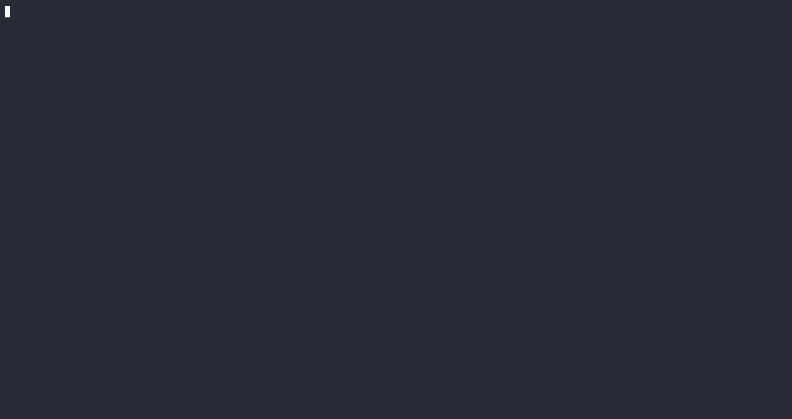

<h1 align="center">wr</h1>
<div align="center">
 <strong>
   A Rust workshop runner
 </strong>
</div>

<br />



`wr` is a CLI to drive test-driven workshops written in Rust.  
It is designed to be used in conjunction with a workshop repository, which contains a series of exercises to be solved
by the workshop participants.

> [!NOTE]
> This workshop runner has been developed by [Mainmatter](https://mainmatter.com/rust-consulting/) to support
> our [hands-on Rust workshops](https://mainmatter.com/services/workshops/rust/).
> Check out our [landing page](https://mainmatter.com/rust-consulting/) if you're looking for Rust consulting or
> training!

## How it works

> What I cannot create, I do not understand.
>
> Richard Feynman

A test-driven workshop is structured as a series of exercises.  
Each exercise is a Rust project with a set of tests that verify the correctness of the solution.

`wr` will run the tests for the current exercise and, if they pass, allow you to move on to the next exercise while
keeping track of what you have solved so far.

You can see it in action in the [rust-telemetry-workshop](https://github.com/mainmatter/rust-telemetry-workshop).

## Installation

```bash
cargo install workshop-runner
```

Check that it has been installed correctly:

```bash
wr --help
```

## Usage

Run

```bash
wr
```

from the top-level folder of a workshop repository to verify the solution for the current exercise
and move forward in the workshop.

You can also navigate to a specific exercise and then run `wr check` from inside its directory
to verify its solution, regardless of what the current exercise is.

### Continuous checking

You can combine `wr` with [`cargo-watch`](https://crates.io/crates/cargo-watch) to re-check your solution every time you
make a change
to the code:

```bash
cargo watch -- wr
```

This combines well with the `--keep-going` flag, which makes `wr` open the next exercise upon completion of the current one:

```bash
cargo watch -- wr --keep-going
```

## Folder structure

`wr` expects the following structure for the workshop repository:

```
.
├── exercises
│  ├── 00_<collection name>
│  │  ├── 00_<exercise name>
│  │  │  ..
│  │  ├── 0n_<exercise name>
│  │  ..
│  ├── 0n_<collection name>
│  │  ├── 00_<exercise name>
│  │  │  ..
│  │  ├── 0n_<exercise name>
```

Each `xx_<exercise name>` folder must be a Rust project with its own `Cargo.toml` file.

You can choose a different top-level folder name by either passing the `--exercises-dir` flag when invoking `wr`
or by creating a top-level `wr.toml` file with the following content:

```toml
exercises-dir = "my-top-level-folder"
```

You can refer to [rust-telemetry-workshop](https://github.com/mainmatter/rust-telemetry-workshop) as an example.

